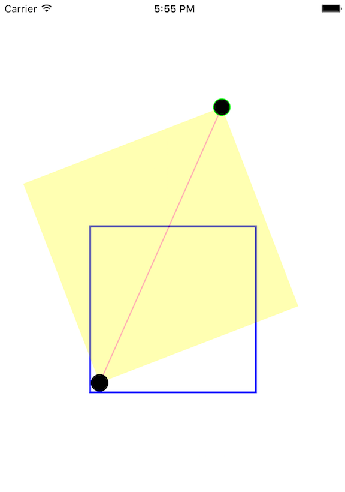

# Lines

Toy project to play around with line transformation in CAShapeLayer.

As shown in the picture below. We can use pan gesture to rotate/scale the line and the yellow rectangle, the left-bottom circle (without green boundary) serves as the anchor point.

The circles, the line, are all CAShapeLayers.

